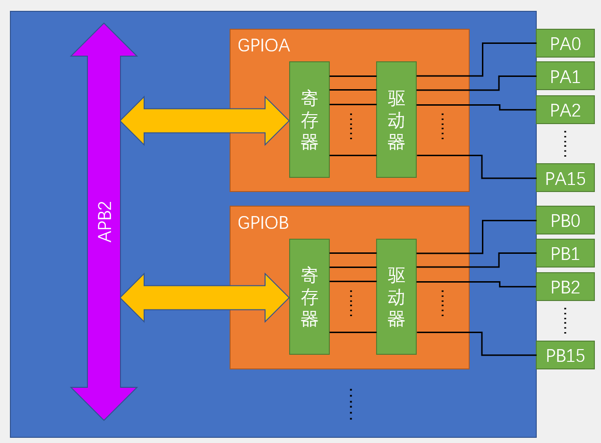
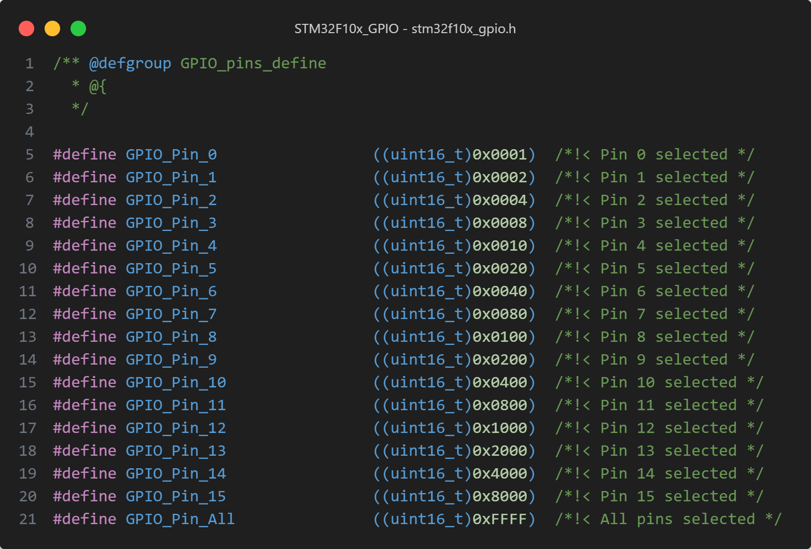

# GPIO简介

GPIO: General Purpose Input/Output

GPIO是通用输入输出端口，与之对立的是**专用**，没有限制应用场景、使用目的

可以通过 GPIO 输出高电平或者低电平，也可以通过其读入引脚电平状态——是高电平还是低电平

STM32F10x 系列芯片最多有 7 组 GPIO ，分别是：GPIOA、GPIOB、GPIOC、GPIOD、GPIOE、GPIOF、GPIOG，每组 GPIO 都有 16 个引脚（Pin0 ~ Pin15，不一定全部引出来了，要看芯片的封装）

可以通过设置寄存器，使引脚工作在输入模式、输出模式、复用模式（串口、ADC、SPI...）


# GPIO引脚模式

每个 GPIO Pin 可配置为8种输入输出模式（参考 GPIOx_CRL、GPIOx_CRH 寄存器）：

|   配置模式   | CNF1 | CNF0 | MODE1:MODE0 | PxODR寄存器 |
|:--------:|:----:|:----:|:-----------:|:-----------:|
| 通用推挽输出 |  0   |  0   |  01、00、11   |   0 或 1    |
| 通用开漏输出 |  0   |  1   |  01、00、11   |   0 或 1    |
| 复用推挽输出 |  1   |  0   |  01、00、11   |   不使用    |
| 复用开漏输出 |  1   |  1   |  01、00、11   |   不使用    |
|   模拟输入   |  0   |  0   |     00      |   不使用    |
|   浮空输入   |  0   |  1   |     00      |   不使用    |
|   下拉输入   |  1   |  0   |     00      |      0      |
|   上拉输入   |  1   |  0   |     00      |      1      |


特别说明：
- 做上拉输入时，PxODR 寄存器的对应位必须置1，会接内部电阻到VDD
- 做下拉输入时，PxODR 寄存器的对应位必须清0，会接内部电阻到GND
- 浮空输入就是什么都不接
- 模拟输入一般是用在ADC采样

GPIOx_CRL、GPIOx_CRH 寄存器中的每 4Bit 对应一个 GPIO 引脚，下面是常用的引脚配置参数

| 配置参数 |                      功能                      |
|:--------:|:--------------------------------------------:|
|   0000   |             模拟输入，使用ADC功能时             |
|   0011   |         推完输出，速率50MHz，做输出口用          |
|   0100   |                浮空输入，复位值                 |
|   1000   |            上拉/下拉输入，做输入口用            |
|   1011   | 复用推挽输出，其实就是Pin的复用功能，串口、SPI... |

GPIOx_CRL、GPIOx_CRH 寄存器的复位值是 0x44444444 ，也就是说复位之后，引脚的默认状态是浮空输入

MODE1 和 MODE0 用来配置引脚是输入还是输出以及输出的速率

|                | MODE1 | MODE0 |
|:--------------:|:-----:|:-----:|
|    输入模式    |   0   |   0   |
| 输出模式，10MHz |   0   |   1   |
| 输出模式，2MHz  |   1   |   0   |
| 输出模式，50MHz |   1   |   1   |

引脚电平：0~3.3V，**部分**引脚可容忍5V
- 容忍5V的意思是这个端口可以输入5V电压，5V也认为是高电平，即数字1
- 对于输出而言，最大就只能输出3.3V，因为供电就只有3.3V，也就是驱动能力

输出模式下可以控制端口输出高低电平，用来驱动LED、控制蜂鸣器、模拟通信协议输出时序等

输入模式下可以读取端口的高低电平或电压，用于读取按键输入、外接模块电平信号输入、ADC电压采集（模拟输入）、模拟通信协议接收数据等

# GPIO基本结构

GPIO外设挂载在APB2总线上，所以使用之前要开启对应的时钟

```C
/**
  * @brief  Enables or disables the High Speed APB (APB2) peripheral clock.
  * @param  RCC_APB2Periph: specifies the APB2 peripheral to gates its clock.
  *   This parameter can be any combination of the following values:
  *     @arg RCC_APB2Periph_AFIO, RCC_APB2Periph_GPIOA, RCC_APB2Periph_GPIOB,
  *          RCC_APB2Periph_GPIOC, RCC_APB2Periph_GPIOD, RCC_APB2Periph_GPIOE,
  *          RCC_APB2Periph_GPIOF, RCC_APB2Periph_GPIOG, RCC_APB2Periph_ADC1,
  *          RCC_APB2Periph_ADC2, RCC_APB2Periph_TIM1, RCC_APB2Periph_SPI1,
  *          RCC_APB2Periph_TIM8, RCC_APB2Periph_USART1, RCC_APB2Periph_ADC3,
  *          RCC_APB2Periph_TIM15, RCC_APB2Periph_TIM16, RCC_APB2Periph_TIM17,
  *          RCC_APB2Periph_TIM9, RCC_APB2Periph_TIM10, RCC_APB2Periph_TIM11     
  * @param  NewState: new state of the specified peripheral clock.
  *   This parameter can be: ENABLE or DISABLE.
  * @retval None
  */
void RCC_APB2PeriphClockCmd(uint32_t RCC_APB2Periph, FunctionalState NewState)
{
  /* Check the parameters */
  assert_param(IS_RCC_APB2_PERIPH(RCC_APB2Periph));
  assert_param(IS_FUNCTIONAL_STATE(NewState));
  if (NewState != DISABLE)
  {
    RCC->APB2ENR |= RCC_APB2Periph;
  }
  else
  {
    RCC->APB2ENR &= ~RCC_APB2Periph;
  }
}

void GPIO_Clock_Enable()
{
    RCC_APB2PeriphClockCmd(RCC_APB2Periph_GPIOA, ENABLE);
}
```

GPIO结构简化图如下：



每个GPIO外设，都有16个引脚，编号是0~15



寄存器是一个特殊的**存储器**，本质是存储器，特殊在直接和硬件打交道


# GPIO配置过程

1. 打开相应的GPIO组时钟源，GPIO都挂载在APB2总线上
    - 上电之后，所有外设的时钟源都是关闭的，避免开发者不知道关闭哪些不用的设备
    - 开发者只需要关心自己要用哪些设备，去开启对应设备的时钟源即可
2. 设置 GPIO 引脚模式和时钟速度
3. 设置 GPIO 对应设备的初始状态（比如LED默认亮还是灭）
