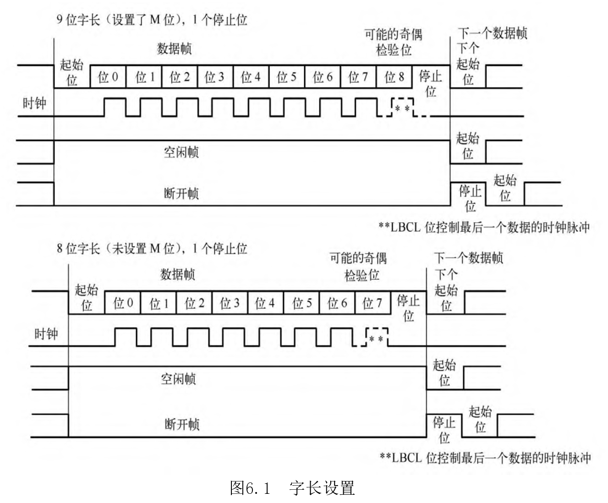
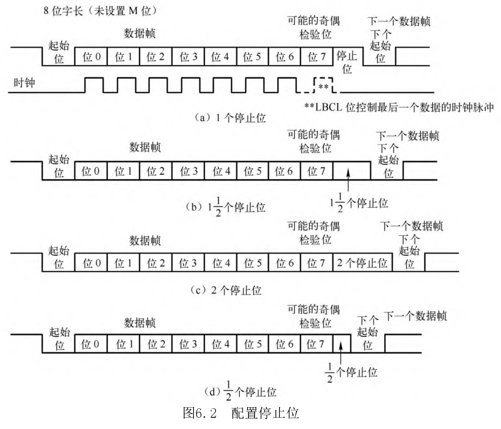

# 串行通信和串行接口简介

串行接口（Serial Interface）是指数据一位一位地顺序传送，其特点是：
- 通信线路简单，只要一对传输线就可以实现**双向通信**
- 因为所需的通信线少，所以成本大大降低
- 因为数据是一位一位地传输的，所以通信速度慢
- 特别适用于远距离通信
    - 远距离通信，所有的通信线都要做长
    - 串行接口线少，因此把线做长的成本低；当然这是相较于并行接口而言，并行接口线多
    - 此外，并行通信还需要考虑数据同步的问题，通信距离长了，数据同步难度会上升
- 并行接口一般适用于开发板上的短距离通信

-----

一条信息的各位数据被逐位按顺序传送的通信方式称为**串行通信**，串行通信的特点是：
- 数据位的传送，按位顺序进行，最少只需要一根传输线即可完成
- 成本低但是传送速度慢
- 串行通信的距离可以从几米到几千米
- 根据信息的传送方向，串行通信可以进一步分为单工、半双工和全双工三种

|                    | 单工 | 半双工 | 全双工 |
|:------------------:|:----:|:-----:|:-----:|
|        方向        | 单向 |  双向  |  双向  |
| 是否能同时双向传输 |  X   |   否   |   是   |


# UART简介

UART: Universal Asynchronous Receiver/Transmitter

USART: Universal Synchronous/Asynchronous Receiver/Transmitter

UART包含TTL电平的串口和RS232电平的串口
- TTL电平用3.3V表示逻辑1，用0V表示逻辑0
- RS232是负逻辑电平，定义 +5V ~ +12V 表示逻辑0，-12V ~ -5V 表示逻辑1
- RS232一般用于工业环境等干扰较多、环境比较恶劣的地方

串行接口按电气标准以及协议来分包括RS-232-C、RS-422、RS485等，RS-232-C、RS-422、RS485 标准，只对接口的电气特性做出规定，不涉及插件、电缆或协议

USART接口通过三个引脚与其他设备连接在一起，任何USART双向通信至少需要两个引脚：数据接收引脚RX和数据发送引脚TX
- RX：接收数据串行输入，通过采样技术来区别数据和噪声，从而恢复原始数据
- TX：发送数据输出，当发送器被禁止时，输出引脚恢复到它的I/O端口配置；当发送器被激活，并且不发送数据时，TX引脚处于高电平；在单线和智能卡模式里面，此I/O口被同时处于数据的发送和接收

注意事项：
- 总线在发生或接收前应该处于空闲状态
- 一个起始位
- 一个数据字（8或9位），最低有效位在前
- 0.5、1.5、2个停止位，由此表明数据帧的结束
- 使用分数波特率发生器——12位整数和4位小数的表示方法
- 一个波特率寄存器（USART_BRR），12位整数和4位小数
- 一个智能卡模式下的保护时间寄存器（USART_GTPR）


# USART特性

总线在空闲状态下，引脚电平是高电平，所以用低电平来表示起始位，用高电平来表示停止位

空闲符号被视为完全由 '1' 组成的一个完整的数据帧，后面跟着包含了数据的下一帧的起始位
- 原本起始位应该是 '0' ， 空闲符号中变成 '1'

断开符号被视为在下一个帧周期内全部收到 '0'
- 包括停止位，原来应该是 '1' ， 现在也是 '0'
- 在断开帧结束时，发送器再插入1或2个停止位（此时是'1'）来应答起始位

字长可以通过配置 USART_CR1 寄存器中的 M 位，选择成8或9位

字长设置和配置停止位如下所示：






# 串口如何工作

串口有两种工作方式：查询和中断

查询：
- 串口程序不断地循环查询，查看当前有没有数据要它传送
- 如果有，就帮助传送】
- 这种方式实时性不高，跟用轮询方式检测按键一样

中断：
- 当串口打开中断时，如果发现一个数据到来或者数据发送完毕，则会产生中断
- 这意味着CPU要帮它实现数据的传输
- 数据量小的时候可以采用这种方式，数据量大的时候会频繁的进入中断

是不是漏掉了DMA的方式？？？

|      | 查询 |   中断   | DMA |
|:----:|:---:|:------:|:---:|
| 效率 |  低  | 看数据量 | 高  |


# 波特率的产生

接收器和发送器的波特率在 USARTDIV 的整数和小数寄存器中的值应设置成相同

$$
Baudrate = \frac{fck}{16 * USARTDIV}
$$

这里的fck是外设的时钟
- PCLK1用于USART2、USART3、USART4、USART5
- PCLK2用于USART1

USARTDIV是一个无符号的定点数
- 这12位的值设置在USART_BRR寄存器中


# 串口配置步骤

1. RCC时钟配置：开启相应的GPIO组时钟和相应的串口时钟
2. GPIO配置：在GPIO配置中，将发送端的引脚配置为复用推挽输出，将接收端的引脚配置为浮空输入
3. USART配置：USART寄存器的配置
4. NVIC配置：设置串口的中断抢占优先级和亚优先级
5. 发送/接收数据：通过串口数据寄存器接收和发送数据


# USB口转串口芯片介绍

[常用的USB转串口芯片](https://blog.csdn.net/little_grapes/article/details/121964998 "CSDN")

|          | CP2102/2103 | CH340系列 | FT232R | PL2303HX |
|:--------:|:-----------:|:--------:|:------:|:--------:|
| 生产厂家 |   Silicon   | 南京沁恒  |  FDTI  | Prolific |
|  稳定性  |     好      |    好     |  最好  |    差    |
|   价格   |     中      |    低     |   高   |    低    |

随着USB接口的普及，现在的电脑都把串口去掉了，单片机的串口要想和电脑通信，只能通过USB转串口芯片（USB转TTL电平，单片机一般都是TTL电平）

USB转串口电路可以在开发板上实现，即板载USB转串口电路，也可以用专门的USB转串口模块，这些模块都是基于上面四款芯片实现的，使用之前要安装对应的驱动程序

以CH340实现的USB转串口模块为例，下面是该模块的使用方法

- [CH340 USB转串口模块使用方法](https://blog.csdn.net/BBA_Code/article/details/129050168 "CSDN")


# 数据显示模式

```C

char* hex = "\x31\x32\x33\x34\x35";
char* ascii = "12345";

//ASCII是给人看的，是经过转换的
//"\x31\x32\x33\x34\x35" 才是原始的数据形式

```

随便一个串口助手，基本上都会有两种显示模式：

- ASCII字符模式
- HEX模式（数值模式的一种，方便人看）

当串口助手收到一个字节为 0x31 的数据时：

- 如果此时是ASCII字符模式，会把该字节自动转换成字符 '1' ，方便人看
- 如果此时是HEX模式，会显示原始的 0x31（这里是数值），当然显示二进制的 00110001 也是可以的，显示成十六进制也是方便人看

如果串口要发送汉字，需要注意源文件的编码（UTF-8、GB2312），然后在接收端也要选择同样的字符编码
- sscom 串口助手好像只能显示GB2312编码的中文？？？

Keil如果直接发送汉字，可能会出现编译报错，需要在 C/C++ 配置中的 Misc Controls 中添加 --no-multibyte-chars


# 串口发送的数据格式

需要明确的是，数据格式是人为定义的（协议），在串口线上传输的只是被编码成 0 和 1 的高低电平，高低电平被翻译成 0 和 1 组成的比特流

- 如何解读这串比特流？
- 这串比特流承载的信息是什么？

要回答上面两个问题，需要找到对应的协议文档


# STM32F103C8T6 串口资源

STM32F103C8T6 有三个串口，为 USART1、USART2、USART3

其中，除了 USART1 是挂载在 APB2 上面的，剩下两个串口都挂载在 APB1 上

|      | USART1 | USART2 | USART3 |
|:----:|:------:|:------:|:------:|
|  TX  |  PA9   |  PA2   |  PB10  |
|  RX  |  PA10  |  PA3   |  PB11  |
| 总线 |  APB2  |  APB1  |  APB1  |


